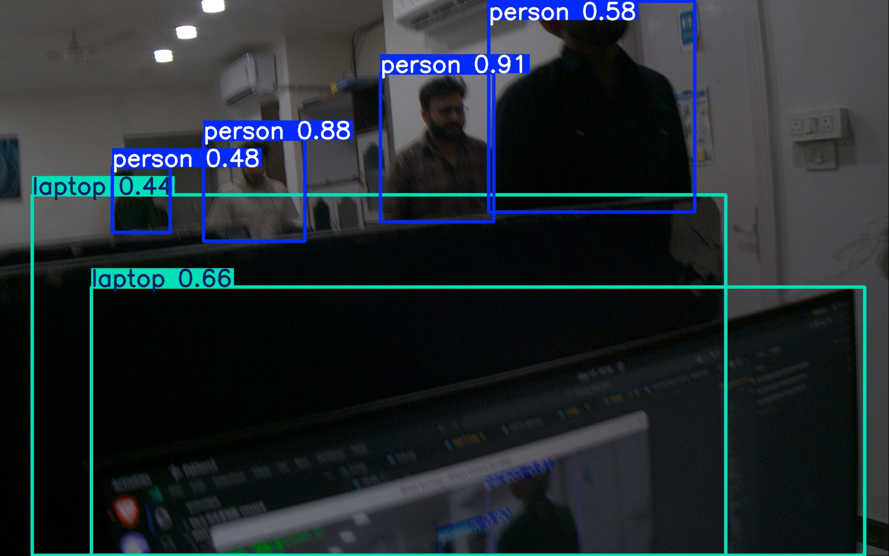
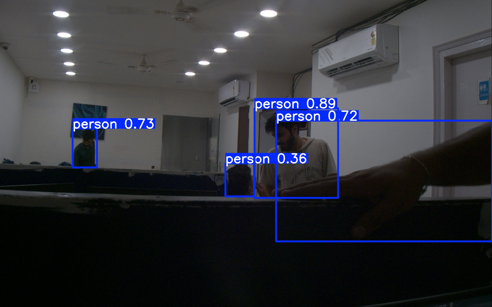
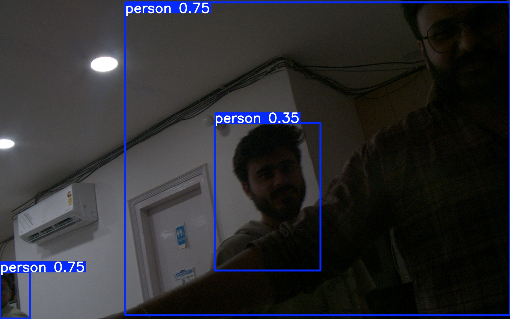

# 🚀 Basler + TensorRT Road Anomaly Detection Pipeline

> Real-time road anomaly detection using Basler industrial camera, YOLO TensorRT, GPS logging, and ByteTrack object tracking — optimized for NVIDIA Jetson AGX Orin.

---

## 🎬 Demo (Live Output)

### 🎥 GIF Preview


### 📸 Detection Samples

| Anomaly | Preview |
|---------|---------|
| Laptop  |  |
| Person  |  |
| Clock   |  |
| Person  |  |

---

## 📌 Overview

This project implements a **real-time road anomaly detection system** using:

| Component | Technology |
|-----------|-----------|
| 📷 Camera | Basler a2A1920-51gcPRO (pypylon SDK) |
| ⚡ AI Inference | YOLOv8 Nano — TensorRT FP16 |
| 🛰️ GPS | NMEA serial → GPX track logging |
| 🎯 Tracking | ByteTrack multi-object tracker |
| 🎥 Recording | H.264 MP4 video (GStreamer pipeline) |
| 📸 Snapshots | Detection images with bounding boxes |
| 📄 Output | Structured JSON anomaly log |

---

## 📷 Camera Hardware

### Basler a2A1920-51gcPRO

| Spec | Value |
|------|-------|
| Resolution | 1920 × 1200 px |
| Frame Rate | Up to 51 fps (30 fps used in pipeline) |
| Sensor | Sony Pregius CMOS — Global Shutter |
| Interface | GigE Vision (1 Gbps) |
| Pixel Format | BayerRG8 (raw, low bandwidth) |
| Color Conversion | BayerRG8 → BGR (OpenCV `cvtColor`) |

**Why Global Shutter?** It captures the entire frame at once — no rolling shutter distortion — critical for a moving vehicle capturing fast road anomalies accurately.

### Edmund Optics 6 mm f/1.85 Lens (Part No. 33301)

| Spec | Value |
|------|-------|
| Focal Length | 6 mm |
| Aperture | f/1.85 (large — good low-light) |
| Field of View | Wide angle (broad road coverage) |
| Distortion | Mild edge distortion (typical for 6 mm) |
| Optimal Working Distance | 0.5 m – 2 m |

---

## ⚙️ Camera Configuration Parameters

### Full Code Configuration

```python
# Camera settings
WIDTH   = 1920    # Full sensor width (maximum detail)
HEIGHT  = 1200    # Full sensor height
FPS     = 30      # Stable GigE frame rate
BITRATE = 12_000_000  # 12 Mbps → ~90 MB / min (raw video)
```

### Detailed Basler SDK Parameter Table

| Parameter | Value | Why This Value |
|-----------|-------|---------------|
| `Width` | `1920` | Full sensor width — maximum road detail |
| `Height` | `1200` | Full sensor height |
| `PixelFormat` | `BayerRG8` | Raw format — reduces GigE bandwidth, required for 30 fps |
| `AcquisitionMode` | `Continuous` | Continuous streaming for real-time video |
| `AcquisitionFrameRateEnable` | `True` | Must enable before setting FPS |
| `AcquisitionFrameRate` | `30.0` | Safe stable FPS on 1 Gbps GigE link |
| `ExposureAuto` | `Off` | Manual for consistent, deterministic exposure |
| `ExposureTime` | `8000 µs` | ~8 ms — balanced indoor lighting |
| `GainAuto` | `Off` | Manual gain — avoids flickering/noise spikes |
| `Gain` | `5.0 dB` | Moderate gain — low sensor noise |
| `BalanceWhiteAuto` | `Continuous` | Auto white balance for color accuracy |
| `GevSCPSPacketSize` | `1500` | MTU-safe packet size (use 9000 with Jumbo frames) |

### Recommended Exposure Reference by Lighting Condition

| Lighting Condition | Exposure Time (µs) | Notes |
|--------------------|-------------------|-------|
| Bright outdoor / direct sun | 500 – 1,500 | Risk of overexposure above 2000 |
| Overcast outdoor | 1,500 – 4,000 | Good general outdoor range |
| Indoor / tunnel | 5,000 – 10,000 | Pipeline default: 8,000 µs |
| Low light / dawn / dusk | 10,000 – 20,000 | May need gain increase |

### Complete Basler SDK Initialization Code

```python
camera.Width.SetValue(1920)
camera.Height.SetValue(1200)
camera.PixelFormat.SetValue("BayerRG8")
camera.AcquisitionMode.SetValue("Continuous")
camera.AcquisitionFrameRateEnable.SetValue(True)
camera.AcquisitionFrameRate.SetValue(30)
camera.ExposureAuto.SetValue("Off")
camera.ExposureTime.SetValue(8000)           # µs — adjust per lighting
camera.GainAuto.SetValue("Off")
camera.Gain.SetValue(5)
camera.BalanceWhiteAuto.SetValue("Continuous")
camera.GevSCPSPacketSize.SetValue(1500)      # Use 9000 if NIC supports Jumbo frames
```

> **Network tip:** Avoid IP `169.254.x.255` (broadcast address). Use a valid host IP such as `169.254.254.10`.

---

## 🛰️ GPS Configuration & Output

### GPS Serial Parameters

| Parameter | Value | Description |
|-----------|-------|-------------|
| `GPS_BAUD` | `9600` | Standard NMEA baud rate |
| Protocol | NMEA 0183 | Industry-standard GPS sentences |
| Interface | USB Serial / UART | `/dev/ttyUSB0` or similar |
| Buffer | Circular (last N fixes) | Prevents memory growth |

### GPS Data Fields Logged Per Frame

| Field | Key | Example | Description |
|-------|-----|---------|-------------|
| Latitude | `lat` | `17.61736077` | Decimal degrees, WGS84 |
| Longitude | `lon` | `80.03804410` | Decimal degrees, WGS84 |
| Fix Quality | `fix` | `1` | 0=no fix, 1=GPS, 2=DGPS |
| Satellites | `sats` | `8` | Number of satellites tracked |

### GPS Output Files

| File | Format | Contents |
|------|--------|---------|
| `track.gpx` | GPX XML | Full route track for GIS / Google Maps |
| `raw.nmea` | Plain text | Raw NMEA sentences for post-processing |

---

## ⚡ AI Inference — Model & TensorRT Optimization

### Model Selection: YOLOv8 Nano

| Model Variant | Params | FPS (Jetson) | Use Case |
|---------------|--------|--------------|---------|
| YOLOv8n (Nano) ✅ | ~3M | Fastest | **This pipeline** — real-time road survey |
| YOLOv8s (Small) | ~11M | Fast | Higher accuracy, less real-time |
| YOLOv8m (Medium) | ~26M | Moderate | Accuracy-focused |
| YOLOv8l / x | ~43–68M | Slow | Offline batch processing |

**Selected: YOLOv8 Nano** — best FPS / accuracy trade-off for edge deployment.

---

### Inference Backend Comparison

| Backend | Precision | Speed | Memory | Status |
|---------|-----------|-------|--------|--------|
| PyTorch (`.pt`) | FP32 | 🐢 Very Slow | High | ❌ Not suitable for real-time |
| TensorRT FP32 | FP32 | 🟡 Moderate | Moderate | ⚠️ Slower than FP16 |
| **TensorRT FP16** ✅ | FP16 | 🚀 **Fastest** | Low | ✅ **Production pipeline** |

### Why TensorRT FP16?

- **FP16 vs PyTorch:** TensorRT FP16 is **3–5× faster** than PyTorch FP32 on Jetson
- **FP16 vs FP32 TensorRT:** FP16 is ~**1.5–2× faster** than FP32 TensorRT
- **Accuracy cost:** Only **~2% mAP drop** from FP32 → FP16 — negligible for road anomaly detection
- **Memory:** FP16 uses half the GPU memory, leaving headroom for video pipeline

```python
MODEL_PATH = "best.engine"   # TensorRT FP16 compiled engine
```

> **To convert your YOLOv8 Nano model to TensorRT FP16:**
> ```bash
> yolo export model=best.pt format=engine half=True device=0
> ```

---

## 🎥 Video Output Specifications

### AI-Annotated Video (Primary Output)

| Parameter | Value | Notes |
|-----------|-------|-------|
| Resolution | 1920 × 1200 | Full sensor resolution |
| Frame Rate | 30 fps | Matches capture rate |
| Codec | H.264 (GStreamer) | Hardware-accelerated on Jetson |
| Bitrate | 12,000,000 bps (12 Mbps) | High quality, manageable size |
| Container | `.mp4` | |
| **File Size** | **~200–250 MB / min** | AI-annotated video (overlays + annotations) |
| Raw Video Size | ~90 MB / min | Without AI overlay (reference) |

> AI-annotated video is larger than raw because annotations (bounding boxes, GPS, frame counter) are burned into each frame before encoding, slightly increasing encoder entropy.

### GStreamer Pipeline (Jetson Optimized)

```python
gst_pipeline = (
    f"appsrc ! videoconvert ! "
    f"nvv4l2h264enc bitrate={BITRATE} ! "
    f"h264parse ! mp4mux ! filesink location={output_path}"
)
```

Uses `nvv4l2h264enc` — Jetson hardware H.264 encoder — for zero CPU overhead during video writing.

---

## 📸 Detection Image Saving

### Naming Convention

```
anomaly_0001_POTHOLE_frame000157_1773745495.jpg
```

| Segment | Example | Meaning |
|---------|---------|---------|
| `0001` | Anomaly counter | Unique sequential anomaly ID |
| `POTHOLE` | Class name | Detected object/anomaly type |
| `frame000157` | Frame number | Exact video frame where detected |
| `1773745495` | Unix timestamp | Epoch time of capture |

### Image Specifications

| Property | Value |
|----------|-------|
| Format | JPEG |
| Quality | 95% |
| Resolution | 1920 × 1200 (full) |
| Content | Frame with bounding boxes burned in |
| Saving | Non-blocking background thread (no FPS impact) |

---

## 📄 JSON Output Format

```json
{
  "Anomalies": [
    {
      "Anomaly number": "1",
      "Timestamp on processed video": "2026-03-17 15:30:22",
      "Anomaly type": "POTHOLE",
      "Frame no.": "157",
      "Latitude": 17.61736077,
      "Longitude": 80.03804410,
      "Distance from start point in meters": "1584.10",
      "Length in meters": "",
      "Width in meters": "",
      "image": "anomaly_images/anomaly_0001_POTHOLE_frame000157.jpg"
    }
  ]
}
```

---

## 🎨 Visual Overlay (Live Display & Video)

Each output frame includes:

- 🟩 Colored bounding boxes per class
- 🔢 Unique anomaly ID label
- 🏷️ Class name label
- 📍 GPS coordinates overlay (lat/lon)
- 🎞️ Frame counter

---

## 🔥 Pipeline Architecture

```
Basler a2A1920-51gcPRO (GigE)
         │
         ▼
   Frame Capture (pypylon)
   BayerRG8 → BGR (OpenCV)
         │
         ▼
 YOLOv8 Nano TensorRT FP16
     Inference @ 30 fps
         │
         ▼
  ByteTrack Object Tracking
   (consistent anomaly IDs)
         │
         ▼
   Anomaly Detection Logic
    (new object = new entry)
         │
    ┌────┴────┬───────────┬────────────┐
    ▼         ▼           ▼            ▼
Video     JSON Log    GPS Sync    Image Save
(.mp4)  (anomalies  (GPX/NMEA)  (background
         .json)                   thread)
```

---

## ⚡ Performance Optimizations

| Optimization | Benefit |
|-------------|---------|
| TensorRT FP16 engine | 3–5× faster than PyTorch |
| YOLOv8 Nano model | Smallest, fastest YOLO variant |
| Background image saving thread | Zero FPS impact from disk I/O |
| GPS circular buffer | No memory growth over long sessions |
| Queue-based pipeline | Decouples capture from processing |
| Jetson HW H.264 encoder | Zero CPU usage for video writing |
| BayerRG8 pixel format | Reduced GigE bandwidth |

---

## 📁 Project Structure

```
road_survey_sessions/
└── SESSION_ID/
    ├── survey_video.mp4          ← AI-annotated H.264 video
    ├── track.gpx                 ← GPS route (GPX format)
    ├── raw.nmea                  ← Raw NMEA GPS sentences
    ├── anomalies.json            ← Structured anomaly log
    └── anomaly_images/
        ├── anomaly_0001_POTHOLE_frame000157_timestamp.jpg
        ├── anomaly_0002_PERSON_frame000284_timestamp.jpg
        └── ...
```

---

## ▶️ How to Run

```bash
python3 v6.py
```

Press `Ctrl + C` to stop recording and finalize all output files.

---

## ⚙️ Requirements

| Package | Purpose |
|---------|---------|
| Python 3.8+ | Runtime |
| OpenCV (GStreamer build) | Frame processing + video writing |
| pypylon | Basler camera SDK |
| ultralytics | YOLO model + ByteTrack |
| TensorRT | Inference engine (`.engine` file) |
| pyserial | GPS NMEA serial reading |
| gpxpy | GPX file generation |

---

## 📊 Output Summary

| Output | File | Description |
|--------|------|-------------|
| 🎥 Annotated video | `survey_video.mp4` | 200–250 MB/min AI video |
| 📄 Anomaly log | `anomalies.json` | All detected anomalies with GPS |
| 🛰️ GPS track | `track.gpx` | Full route for GIS tools |
| 📡 Raw GPS | `raw.nmea` | Raw sentences for post-processing |
| 📸 Detection images | `anomaly_images/*.jpg` | Full-res frames with bounding boxes |

---

## 🚀 Use Cases

- 🛣️ Road condition monitoring & pothole mapping
- 🏙️ Smart city infrastructure inspection
- 🚗 Autonomous vehicle dataset collection
- 🔍 Survey and inspection systems

---

## 🖥️ Target Hardware

**NVIDIA Jetson AGX Orin** — recommended deployment platform.

| Spec | Value |
|------|-------|
| AI Performance | 275 TOPS |
| GPU | 2048-core Ampere |
| TensorRT | Native support |
| GigE | Via USB3/PCIe adapter |

---

## ⭐ Notes

- Large files (videos, images) are **NOT** stored in the repository
- Only source code + JSON logs are version-controlled
- Optimized and tested on **NVIDIA Jetson AGX Orin**
- Currently tested with **YOLOv8 Nano** (person detection class validated)
- TensorRT FP16 conversion results in ~2% accuracy drop — acceptable for production

---

## 👨‍💻 Author

**Hanuai**
